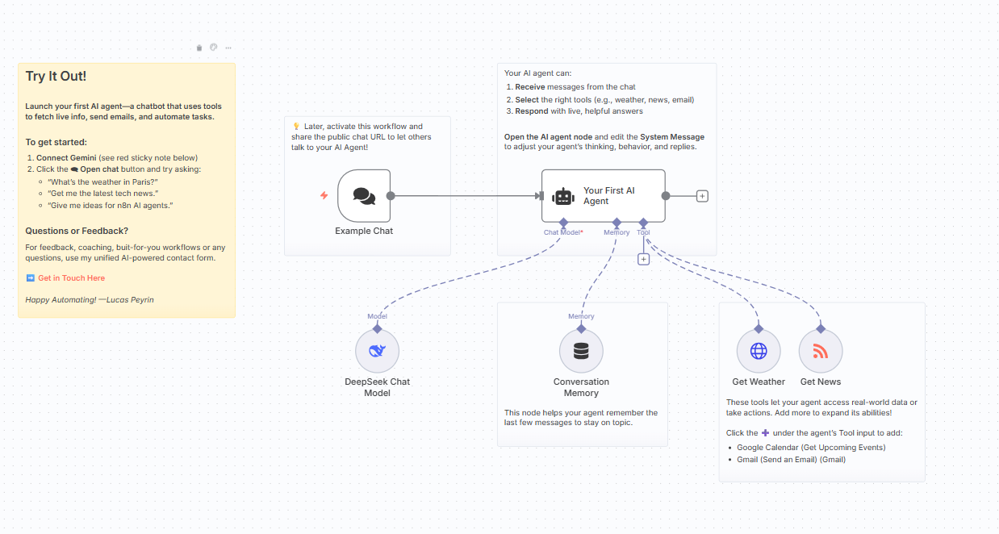
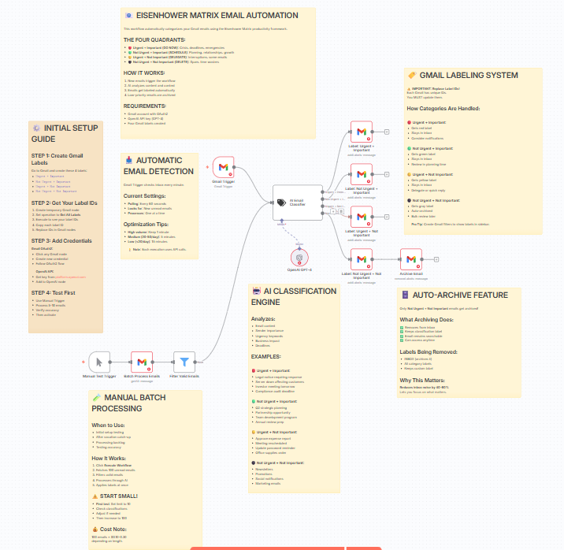
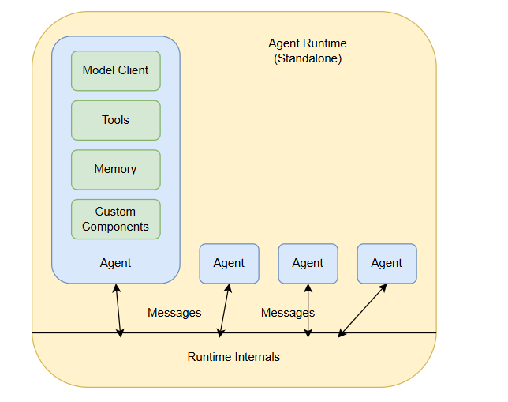
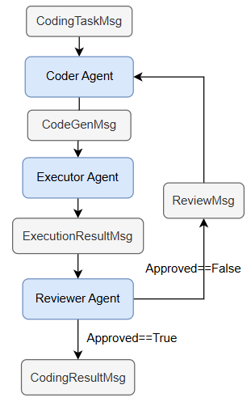
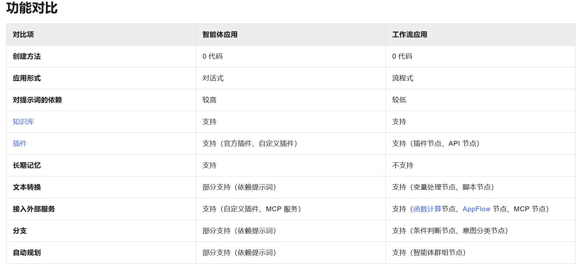

# P1:智能体和工作流含义
**智能体**
{width=700px}
一个基本的智能体需要以下几个部件组成：
1. 输入/输出接口：接收用户或环境的输入，并将智能体的输出返回给用户或其他系统
2. llm模型：作为智能体的“推理引擎”，负责理解输入、生成响应、规划下一步动作
3. 记忆容器：存储和管理智能体的上下文信息，让它能“记住”过去的交互
4. 工具：让智能体能调用外部能力，完成 LLM 本身无法直接完成的任务

 
 

一个基本的工作流由以下几个部件组成：
1. 触发器：定义工作流的启动条件
2. 连接器：让工作流能与外部系统交互
3. 任务节点：工作流中的具体执行步骤
4. 输出 / 终止节点：定义工作流的结束方式和输出结果

 
 

**多智能体**

多智能体情况下，各个智能体可以通过消息传输进行通信，从而实现多智能体协作。

举例：代码生成应用

 
 

**总结：**
智能体：一个具备自主决策能力的执行单元，可以根据环境信息、目标和规则，动态决定下一步行动。
工作流：一组预定义的任务步骤及其执行顺序，用来完成一个业务流程。（类似脚本，但模块化程度更高）
==注意，智能体和工作流是可以互相嵌套的==

 
 

 
 

# p2:开发框架比较
| 名称         | 社区语言 | 开发方式 | 本地化部署 | 文档资料           | 官方文档 | 其他文档     | git     | 其他说明                                                                 | 版权                                      |
| ------------ | -------- | -------- | ---------- | ------------------ | -------- | ------------ | ------- | ------------------------------------------------------------------------ | ----------------------------------------- |
| Dify         | 中文     | 低代码   | 支持       | 官方中文           | [官方文档](https://docs.dify.ai/zh-hans/introduction) |              | [git仓库](https://github.com/langgenius/dify) | 支持调用gpt，gemini等国外模型                                             | Apache License 2.0（多租户限制）          |
| coze         | 中文     | 低代码   | 支持       | 官方中文           | [官方文档](https://www.coze.cn/open/docs/guides) |              | [git仓库](https://github.com/coze-dev/coze-studio) | 主打低代码开发，上手门槛低，字节相关生态完善，但是不支持纯代码开发        | Apache License 2.0                        |
| 阿里云百炼   | 中文     | 低代码   | 不支持     | 官方中文           | [官方文档](https://bailian.console.aliyun.com/?spm=5176.29597918.J_SEsSjsNv72yRuRFS2VknO.2.afe77b08o1GGUq&tab=doc#/doc/?type=app) |              |         | 集成阿里云生态，使用阿里相关的工具便利，但是不支持本地部署               | 允许商用                                  |
| n8n          | 英文     | 低代码   | 支持       | 官方英文+非官方中文 | [官方英文](https://docs.n8n.io/) | [非官方中文](https://www.n8nclub.com.cn/about)   | [git仓库](https://github.com/n8n-io/n8n) | 功能完善，UI友好，但是英文参考文档，且上手难度略高                        | 非商用免费，商用需购买许可                 |
| agentscope   | 中文     | 代码     | 支持       | 官方中文           | [官方文档](https://doc.agentscope.io/zh_CN/index.html) |              | [git仓库](https://github.com/agentscope-ai/agentscope) | 支持多agent协作，开发文档内容详细                                         | Apache License 2.0                        |
| autogen      | 英文     | 代码     | 支持       | 官方中文           | [官方文档](https://msdocs.cn/autogen/stable/user-guide/core-user-guide/quickstart.html) |              | [git仓库](https://github.com/microsoft/autogen) | 微软开源多 Agent 协作框架                                                 | CCA 4.0                                   |
| langchain    | 英文     | 代码     | 支持       | 官方中文           | [官方文档](https://python.langchain.ac.cn/docs/how_to/installation/) | [非官方中文](https://cookbook.langchain.com.cn/docs/langchain-intro/)  | [git仓库](https://github.com/langchain-ai/langchain) | 生态丰富，附带的LangGraph适合复杂工作流                                  | MIT License                               |

 
 

# p3：demo介绍
agentscope.ipynb
autogen.ipynb
langchain.ipynb
langgraph.ipynb

